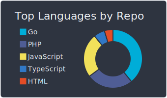
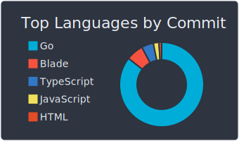
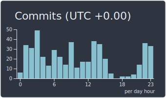

Everyday learn new things 🌈

### Statistic :  

### I'm Listening : 

# :sparkling_heart: Contributions

Isometric view of contributions in the last year. Languages pie is based on recent commits

# :dizzy: Metrics and Statistics

# :four_leaf_clover: Other Public Profile

<table>
    <tr>
        <td>

        </td><td>

        </td><td>

        </td><td>

        </td>
    </tr>
</table>

